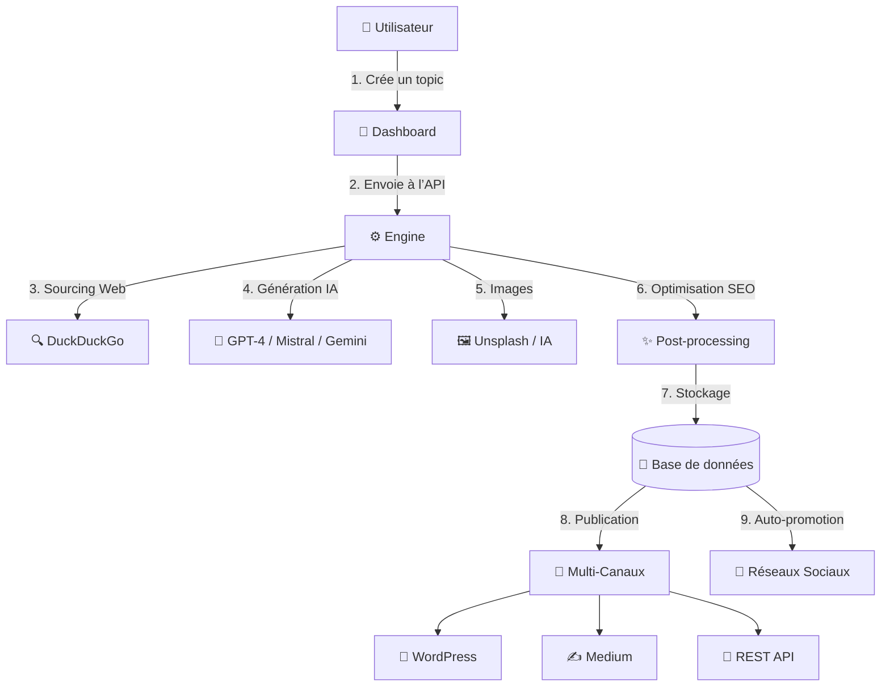

# 🚀 Artical – Générateur d’Articles Intelligents

**Plateforme complète de génération automatique d’articles multilingues optimisés SEO par Intelligence Artificielle**

  
  

---

## 🎯 Vision du Projet

**Artical** transforme la création de contenu en un processus automatisé, intelligent et multilingue.  
La plateforme permet de générer des articles de haute qualité, optimisés SEO, et de les publier automatiquement sur vos canaux préférés.

> **De l’idée à la publication en quelques clics**, dans plusieurs langues, avec des personas uniques et des visuels générés automatiquement.

---

## ✨ Fonctionnalités Principales

### 🤖 Génération Intelligente
- **IA Multi-Modèles** : compatibilité avec OpenAI GPT-4, Mistral AI, Google Gemini  
- **Multilingue Natif** : Français, Anglais, Espagnol (extensions prévues)  
- **7 Personas Uniques** : styles d’écriture cohérents et variés  
- **Formats Multiples** : articles, podcasts, vidéos *(en développement)*  

### 🔍 Sourcing Automatique
- **Recherche Web Intelligente** (DuckDuckGo + filtrage contextuel)  
- **Extraction et structuration** automatiques du contenu  
- **Vérification de crédibilité** et citations automatiques  

### 🎨 Enrichissement Visuel
- **Images libres de droits** (Unsplash, etc.)  
- **Génération IA** (DALL-E, Stable Diffusion)  
- **Alt-text & compression automatiques**  
- **Positionnement contextuel des visuels**  

### 📝 Post-Production Avancée
- **Optimisation SEO** : métas, mots-clés, hiérarchie H1–H6  
- **Corrections grammaticales multi-passes**  
- **Formatage adaptatif** : HTML, Markdown, etc.  
- **Intégration médias** (vidéos, audio, infographies)  

### 🌐 Publication Multi-Canaux
- **WordPress / Medium / API REST**  
- **Planification différée et récurrente**  
- **Gestion automatisée des catégories et tags**

### 📱 Auto-Promotion Réseaux Sociaux *(Roadmap)*
- Distribution automatique (X, LinkedIn, Instagram, etc.)  
- Adaptation du ton et du format par plateforme  
- Scheduling intelligent + hashtags contextuels  
- Analytics d’engagement en temps réel  

---

## 🏗️ Architecture Technique

Artical repose sur deux briques principales travaillant en synergie :

### ⚙️ **Artical Engine (API)**
*Moteur de génération et d’orchestration de contenu*

#### Caractéristiques
- **Architecture distribuée à workers dynamiques** : chaque tâche de génération est déléguée à un *process* Linux isolé, instancié à la volée selon la charge du système.  
- **Autoscaling intelligent** : le moteur peut créer, superviser et détruire dynamiquement ses workers pour s’adapter au volume de requêtes en temps réel.  
- **Fault-tolerance & auto-recovery** : en cas d’erreur ou d’interruption, les processus sont automatiquement relancés, garantissant une continuité sans perte de données.  
- **Nettoyage automatique de la mémoire et des threads** : chaque worker s’auto-nettoie après exécution pour préserver les performances et éviter les fuites mémoire.  
- **Surveillance centralisée** : une interface interne permet de visualiser en direct les processus actifs, de les stopper, les relancer ou les prioriser manuellement.  
- **Scalabilité horizontale native** : plus le nombre de workers augmente, plus le système traite simultanément de tâches, garantissant une montée en charge fluide.  
- **API REST complète** couvrant tout le pipeline de génération et de publication.  
- **Gestion des files d’attente** (queue management) et reprise automatique sur erreur.  

#### Technologies
- PHP 8.3+  
- MySQL 8.0  
- Supervisor (supervision & orchestration de process)  
- OpenRouter (agrégation de modèles IA)  
- API externes : Unsplash, DuckDuckGo  

#### Workflow
1. Réception du **topic**  
2. **Sourcing web** automatisé  
3. **Génération IA** via modèle choisi et persona  
4. **Enrichissement SEO & visuel**  
5. **Post-processing** et corrections  
6. **Stockage & publication**

---

### 🎨 **Artical Dashboard (Front)**
*Interface de pilotage et de supervision*

#### Caractéristiques
- Dashboard temps réel  
- Gestion de topics et personas  
- Système de crédits et facturation  
- Multi-utilisateurs avec rôles  
- Prévisualisation dynamique des articles  
- API pour intégrations tierces  
- **Monitoring des workers** : état, charge CPU, file d’attente, actions manuelles possibles (pause, redémarrage, priorisation).  

#### Technologies
- Laravel 12  
- Tailwind CSS  
- Vite  
- MySQL 8  

---

## 🛠️ Workflow Global

---

## 🎭 Les 7 Personas

| Persona | Style | Expertise | Langues |
|---------|-------|-----------|---------|
| 👨‍💼 **Camille Perrin** | Professionnel, analytique | Business, tech, innovation | FR / EN / ES |
| 👩‍🔬 **Dr. Marie Laurent** | Académique, rigoureuse | Science, santé, recherche | FR / EN / ES |
| ✍️ **Thomas Dubois** | Créatif, narratif | Culture, arts, lifestyle | FR / EN / ES |
| ⚖️ **Sophie Martin** | Formel, précis | Juridique, finance, politique | FR / EN / ES |
| 🎨 **Lucas Bernard** | Accessible, pédagogique | Tech, tutoriels | FR / EN / ES |
| 🌍 **Emma Rousseau** | Journalistique, factuel | Actualités, investigation | FR / EN / ES |
| 💡 **Alex Moreau** | Inspirant, motivant | Développement personnel | FR / EN / ES |

---

## 📊 Avantages Clés

- **🚀 Rapidité** : génération complète en 2-5 min grâce à la parallélisation des workers  
- **💰 Économie** : 90 % moins cher qu’une agence  
- **🌍 Scalabilité** : architecture distribuée et extensible  
- **🎯 Qualité** : SEO + cohérence stylistique garanties  
- **🔧 Flexibilité** : API complète, formats multiples, configuration fine  

---

## 📈 Indicateurs & Performance (bêta interne)

| Catégorie | Donnée |
|------------|--------|
| Articles générés / jour | 500+ |
| Langues actives | 3 |
| Score SEO moyen | 87/100 |
| Uptime moteur | 99.2 % |
| Temps moyen génération | 2–5 min |
| Satisfaction bêta-testeurs | à venir |

---

## 🗺️ Roadmap 2025-2026

### Q1 2025 ✅
- Architecture moteur & front opérationnelle  
- 7 personas multilingues  
- Publication WordPress / Medium / API  

### Q2 2025 🚧
- Auto-promotion sociale  
- Génération audio/podcast  
- Support vidéo (YouTube, TikTok)  
- Nouvelles langues : DE / IT / PT  

### Q3-Q4 2025 📅
- Marketplace de personas  
- API publique documentée  
- Application mobile iOS / Android  
- Version white-label  

---

## 💼 Modèle Économique

- **Pay-as-you-go** : facturation au token  
- **Forfaits mensuels** : volumes flexibles  
- **API commerciale B2B**  
- **White-label** pour agences  

Optimisé par une architecture cloud scalable, un cache IA adaptatif et un sourcing libre (DuckDuckGo, Unsplash).

---

## 🌟 Pourquoi Artical ?

- **Orchestration distribuée avancée** : processus dynamiques, monitoring temps réel et reprise automatique  
- **Solution multilingue unique** avec personas natifs  
- **Publication multi-canaux** intégrée  
- **Sourcing vérifié** (limite les hallucinations)  
- **Qualité éditoriale** comparable à un rédacteur humain  

---

## 📞 Contact & Démo

📧 **contact@artical.dev**  
🌐 **[Page de présentation](#)** *(démo à venir)*  

---

### 🚀 **Rejoignez la Révolution du Contenu Intelligent**

**Artical — L’IA qui écrit, illustre, publie et promeut pour vous.**  
*De l’idée à la viralité en quelques clics*
