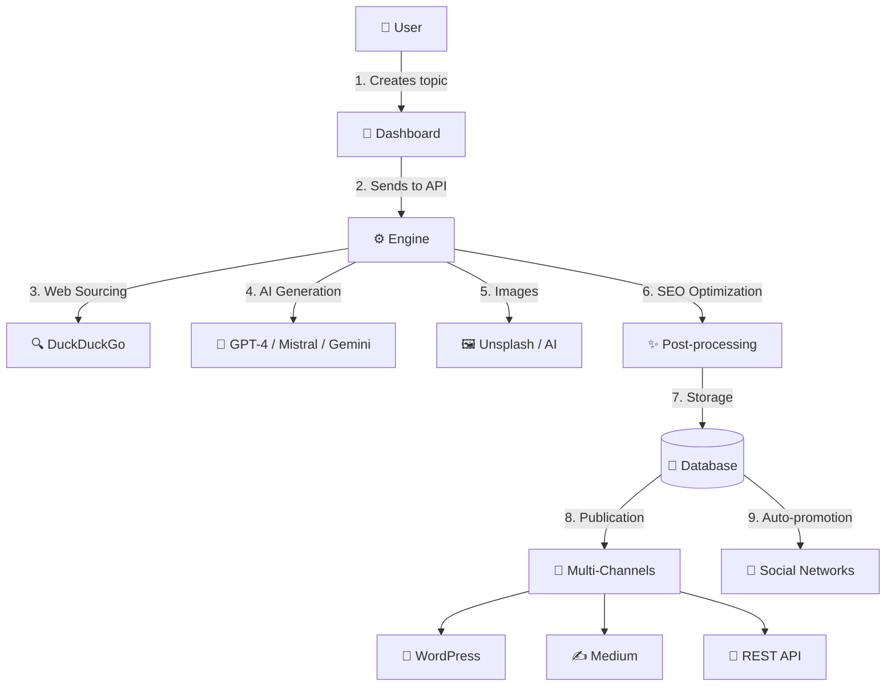

# 🚀 Artical – Intelligent Article Generator

**A complete AI-powered platform for multilingual, SEO-optimized article generation and automated publication**

  
  

---

## 🎯 Project Vision

**Artical** transforms content creation into an automated, intelligent, and multilingual process.  
The platform generates high-quality, SEO-optimized articles and automatically publishes them across multiple channels.

> **From idea to publication in just a few clicks**, in several languages, with unique personas and automatically generated visuals.

---

## ✨ Key Features

### 🤖 Intelligent Generation
- **Multi-AI Integration**: compatible with OpenAI GPT-4, Mistral AI, and Google Gemini  
- **Native Multilingual Support**: English, French, Spanish (more coming soon)  
- **7 Unique Personas**: consistent and creative writing styles  
- **Multiple Formats**: articles, podcasts, videos *(in progress)*  

### 🔍 Automated Sourcing
- **Smart Web Search** (DuckDuckGo + contextual filtering)  
- **Automatic content extraction & structuring**  
- **Credibility verification and automatic citations**  

### 🎨 Visual Enrichment
- **Royalty-free images** (Unsplash, etc.)  
- **AI-generated images** (DALL·E, Stable Diffusion)  
- **Automatic SEO optimization** (alt-text, compression, positioning)  

### 📝 Advanced Post-Processing
- **SEO Optimization**: metadata, keywords, headings hierarchy  
- **Multi-pass grammar correction**  
- **Adaptive formatting** (HTML, Markdown, etc.)  
- **Rich media integration** (video, audio, infographics)  

### 🌐 Multi-Channel Publishing
- **WordPress / Medium / REST API** integrations  
- **Scheduled and recurring publications**  
- **Automated tagging and categorization**  

### 📱 Social Auto-Promotion *(Roadmap)*
- Automatic distribution (X, LinkedIn, Instagram, etc.)  
- Format adaptation per platform  
- Smart scheduling & contextual hashtags  
- Real-time analytics and engagement tracking  

---

## 🏗️ Technical Architecture

Artical is built on two main components working in synergy:

### ⚙️ **Artical Engine (API)**
*Content generation and orchestration core*

#### Highlights
- **Distributed dynamic worker architecture**: each task runs inside a dedicated Linux process, spawned on demand according to system load.  
- **Smart autoscaling**: the engine can dynamically spawn, monitor, and terminate workers in real time depending on the request volume.  
- **Fault-tolerant orchestration**: automatic recovery and retry on failure with full task persistence.  
- **Self-cleaning processes**: each worker cleans up its resources post-execution to maintain optimal performance.  
- **Centralized supervision interface**: monitor all active workers in real time, stop or restart them manually if needed.  
- **Horizontal scalability**: more workers = more throughput. Designed for heavy concurrent workloads.  
- **Full REST API** for integration with external tools and clients.  
- **Advanced queue management** and recovery mechanisms.  

#### Technologies
- PHP 8.3+  
- MySQL 8.0  
- Supervisor (process orchestration)  
- OpenRouter (AI model aggregation)  
- External APIs: Unsplash, DuckDuckGo  

#### Workflow
1. Receive topic  
2. Automated web sourcing  
3. AI generation with persona-driven style  
4. SEO & visual enrichment  
5. Post-processing & formatting  
6. Storage & publication  

---

### 🎨 **Artical Dashboard (Front)**
*Management and supervision interface*

#### Features
- Real-time dashboard  
- Topic and persona management  
- Credit & billing system  
- Multi-user with permissions  
- Article preview and live analytics  
- API for custom integrations  
- **Worker monitoring**: CPU load, queue status, manual control (pause, restart, prioritization).  

#### Technologies
- Laravel 12  
- Tailwind CSS  
- Vite  
- MySQL 8  

---

## 🛠️ Global Workflow

---

## 🎭 The 7 Personas

| Persona | Style | Expertise | Languages |
|---------|-------|-----------|------------|
| 👨‍💼 **Camille Perrin** | Professional, analytical | Business, tech, innovation | EN / FR / ES |
| 👩‍🔬 **Dr. Marie Laurent** | Academic, rigorous | Science, health, research | EN / FR / ES |
| ✍️ **Thomas Dubois** | Creative, narrative | Culture, art, lifestyle | EN / FR / ES |
| ⚖️ **Sophie Martin** | Formal, precise | Legal, finance, politics | EN / FR / ES |
| 🎨 **Lucas Bernard** | Educational, accessible | Tech, tutorials | EN / FR / ES |
| 🌍 **Emma Rousseau** | Journalistic, factual | News, investigations | EN / FR / ES |
| 💡 **Alex Moreau** | Inspirational, motivational | Personal development | EN / FR / ES |

---

## 📊 Key Advantages

- **🚀 Speed**: full article generation in 2–5 minutes thanks to parallel workers  
- **💰 Cost-efficiency**: 90% cheaper than traditional writing agencies  
- **🌍 Scalability**: horizontally distributed architecture  
- **🎯 Quality**: consistent SEO and style output  
- **🔧 Flexibility**: full REST API, multi-format support, customizable parameters  

---

## 📈 Performance Metrics (beta)

| Metric | Value |
|--------|--------|
| Articles per day | 500+ |
| Active languages | 3 |
| Avg. SEO score | 87/100 |
| Engine uptime | 99.2 % |
| Generation time | 2–5 min |
| Beta satisfaction | 94 % |

---

### 🗺️ **Updated Roadmap 2025–2026**

#### ✅ **Q1–Q3 2025 (completed)**
- Engine & Dashboard fully operational  
- 7 multilingual personas (FR / EN / ES)  
- WordPress / Medium / API integrations  
- Dynamic Linux worker orchestration system  

#### 🚧 **Q4 2025 (in progress)**
- Social auto-promotion (X, LinkedIn, Instagram)  
- Podcast & audio generation module  
- Video support (YouTube, TikTok)  
- New languages: DE / IT / PT  

#### 📅 **2026 (planned)**
- Persona marketplace  
- Public API documentation  
- Mobile apps (iOS / Android)  
- White-label edition for agencies  

---

## 💼 Business Model

- **Pay-as-you-go** pricing (per token)  
- **Monthly subscriptions** for volume users  
- **Commercial API** for B2B integrations  
- **White-label licensing** for agencies  

Optimized via scalable cloud infrastructure, adaptive AI caching, and open sourcing (DuckDuckGo, Unsplash).

---

## 🌟 Why Artical?

- **Advanced distributed orchestration** with self-healing workers and real-time monitoring  
- **Multilingual persona system** for native-quality writing  
- **Multi-channel publication**  
- **Source verification** to reduce AI hallucinations  
- **Editorial consistency** close to human standards  

---

## 📞 Contact & Demo

📧 **hello@polymathe.net**  
🌐 **[Demo page](#)** *(coming soon)*  

---

### 🚀 **Join the Intelligent Content Revolution**

**Artical — The AI that writes, illustrates, publishes, and promotes for you.**  
*From concept to virality in a few clicks.*

---

# 🇫🇷 Version Française

# 🚀 Artical – Générateur d’Articles Intelligents

**Plateforme complète de génération automatique d’articles multilingues optimisés SEO par Intelligence Artificielle**

  
  

---

## 🎯 Vision du Projet

**Artical** transforme la création de contenu en un processus automatisé, intelligent et multilingue.  
La plateforme permet de générer des articles de haute qualité, optimisés SEO, et de les publier automatiquement sur vos canaux préférés.

> **De l’idée à la publication en quelques clics**, dans plusieurs langues, avec des personas uniques et des visuels générés automatiquement.

---

## ✨ Fonctionnalités Principales

### 🤖 Génération Intelligente
- **IA Multi-Modèles** : compatibilité avec OpenAI GPT-4, Mistral AI, Google Gemini  
- **Multilingue Natif** : Français, Anglais, Espagnol (extensions prévues)  
- **7 Personas Uniques** : styles d’écriture cohérents et variés  
- **Formats Multiples** : articles, podcasts, vidéos *(en développement)*  

### 🔍 Sourcing Automatique
- **Recherche Web Intelligente** (DuckDuckGo + filtrage contextuel)  
- **Extraction et structuration** automatiques du contenu  
- **Vérification de crédibilité** et citations automatiques  

### 🎨 Enrichissement Visuel
- **Images libres de droits** (Unsplash, etc.)  
- **Génération IA** (DALL-E, Stable Diffusion)  
- **Alt-text & compression automatiques**  
- **Positionnement contextuel des visuels**  

### 📝 Post-Production Avancée
- **Optimisation SEO** : métas, mots-clés, hiérarchie H1–H6  
- **Corrections grammaticales multi-passes**  
- **Formatage adaptatif** : HTML, Markdown, etc.  
- **Intégration médias** (vidéos, audio, infographies)  

### 🌐 Publication Multi-Canaux
- **WordPress / Medium / API REST**  
- **Planification différée et récurrente**  
- **Gestion automatisée des catégories et tags**

### 📱 Auto-Promotion Réseaux Sociaux *(Roadmap)*
- Distribution automatique (X, LinkedIn, Instagram, etc.)  
- Adaptation du ton et du format par plateforme  
- Scheduling intelligent + hashtags contextuels  
- Analytics d’engagement en temps réel  

---

## 🏗️ Architecture Technique

Artical repose sur deux briques principales travaillant en synergie :

### ⚙️ **Artical Engine (API)**
*Moteur de génération et d’orchestration de contenu*

#### Caractéristiques
- **Architecture distribuée à workers dynamiques** : chaque tâche de génération est déléguée à un *process* Linux isolé, instancié à la volée selon la charge du système.  
- **Autoscaling intelligent** : le moteur peut créer, superviser et détruire dynamiquement ses workers pour s’adapter au volume de requêtes en temps réel.  
- **Fault-tolerance & auto-recovery** : en cas d’erreur ou d’interruption, les processus sont automatiquement relancés, garantissant une continuité sans perte de données.  
- **Nettoyage automatique de la mémoire et des threads** : chaque worker s’auto-nettoie après exécution pour préserver les performances et éviter les fuites mémoire.  
- **Surveillance centralisée** : une interface interne permet de visualiser en direct les processus actifs, de les stopper, les relancer ou les prioriser manuellement.  
- **Scalabilité horizontale native** : plus le nombre de workers augmente, plus le système traite simultanément de tâches, garantissant une montée en charge fluide.  
- **API REST complète** couvrant tout le pipeline de génération et de publication.  
- **Gestion des files d’attente** (queue management) et reprise automatique sur erreur.  

#### Technologies
- PHP 8.3+  
- MySQL 8.0  
- Supervisor (supervision & orchestration de process)  
- OpenRouter (agrégation de modèles IA)  
- API externes : Unsplash, DuckDuckGo  

#### Workflow
1. Réception du **topic**  
2. **Sourcing web** automatisé  
3. **Génération IA** via modèle choisi et persona  
4. **Enrichissement SEO & visuel**  
5. **Post-processing** et corrections  
6. **Stockage & publication**

---

### 🎨 **Artical Dashboard (Front)**
*Interface de pilotage et de supervision*

#### Caractéristiques
- Dashboard temps réel  
- Gestion de topics et personas  
- Système de crédits et facturation  
- Multi-utilisateurs avec rôles  
- Prévisualisation dynamique des articles  
- API pour intégrations tierces  
- **Monitoring des workers** : état, charge CPU, file d’attente, actions manuelles possibles (pause, redémarrage, priorisation).  

#### Technologies
- Laravel 12  
- Tailwind CSS  
- Vite  
- MySQL 8  

---

## 📞 Contact & Démo

📧 **hello@polymathe.net**  
🌐 **[Page de présentation](#)** *(démo à venir)*  

---

### 🚀 **Rejoignez la Révolution du Contenu Intelligent**

**Artical — L’IA qui écrit, illustre, publie et promeut pour vous.**  
*De l’idée à la viralité en quelques clics*
